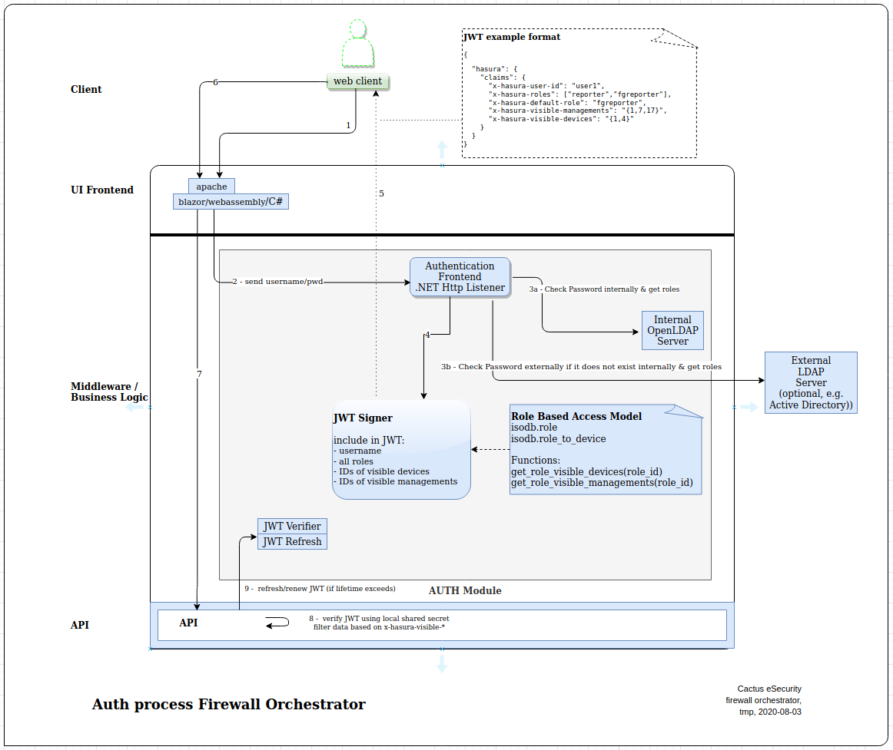

# Hasura Auth
- The role based access control can be found in <https://github.com/CactuseSecurity/firewall-orchestrator/blob/master/documentation/auth/backend/rbac.md>
- how to define roles & permissions in hasura.
- Starting point: https://hasura.io/docs/1.0/graphql/manual/auth/authorization/index.html
- For an example see <https://dev.to/lineup-ninja/modelling-teams-and-user-security-with-hasura-204i>
- see [hasura doc on auth](https://hasura.io/docs/1.0/graphql/manual/auth/authorization/roles-variables.html)



## Todos
- define role based access model:
  - full admin (able to change tables management, device, stm_...)
  - fw admin (able to document changes)
  - reporter (able to request reports)
- defines roles to implement tenant permissions
- add get_user_visible_devices in auth function to create JWT containing dev_ids then use this dev_id list in sign command
- define permissions for all roles
- find an elegant way to define permissions (only via web UI?)
- defining permissions only works for tables containing dev or mgm
- create auth site (using .NET)

## Add Basic roles and permissions in postgresql permissions (grants)
- anonymous
- reporter
- fw-admin
- admin
- ... more: see <https://github.com/CactuseSecurity/firewall-orchestrator/blob/master/documentation/auth/backend/rbac.md>
Second Layer of roles then allows granular access based on device permissions

## prerequisites: prepare for hasura auth
Hasura permissions are based on roles. Table permissions are defined on a per-role basis, user-specific permissions can be realized using functions with X-Hasura-User-Id as input parameter.

1) create roles (role based access control, RBAC)
    - admin - full admin - able to change tables management, device, stm_...: full access for insert, select, update, delete
    - reporters - able to request reports: no insert, update, delete for "data tables" like management, rule, object, ...:  select access restricted via functions returning visible mgmts or devices
    - fw-admin - able to document changes: to be defined later

2) use stored procedures to create set of ids
~~~console
  - FUNCTION public.get_role_visible_devices(integer) RETURNS SETOF integer
  - FUNCTION public.get_role_visible_managements(integer) RETURNS SETOF integer 
~~~

3) add the result of the functions to the jwt!
see <https://hasura.io/blog/hasura-authentication-explained/#jwt-auth> and <https://dev.to/lineup-ninja/modelling-teams-and-user-security-with-hasura-204i>

Use existing functions to create list of device & user ids:
- FUNCTION public.get_user_visible_devices(integer) RETURNS SETOF integer
- FUNCTION public.get_user_visible_managements(integer) RETURNS SETOF integer 

Use pgjwt to create jwt as follows (get secret from /usr/share/itsecorg/api/jwt_secret):
~~~sql
  select sign('{
  "sub": "1234567890",
  "name": "Tim Purschke",
  "iat": 1516239022,
  "hasura": {
    "claims": {
      "x-hasura-allowed-roles": ["anonymous","cpreporter","reporter","admin"],
      "x-hasura-default-role": "reporter",
      "x-hasura-role": "reporter",
      "x-hasura-user-id": "tim",
      "x-hasura-org-id": "123",
      "x-hasura-visible-managements": "{1,7,17}",
      "x-hasura-visible-devices": "{1,4}"
    }
  }
}
', '<secret>');
~~~

4) set permissions for tables in data

tables with device & management reference:
~~~json
    "filter": {
        "_and": [
            {
                "mgm_id": {
                    "_in": "X-Hasura-visible-managements"
                }
            },
            {
                "dev_id": {
                    "_in": "X-Hasura-visible-devices"
                }
            }
        ]
    },
~~~
tables with management reference (object, service):
~~~json
    "filter": {
        "mgm_id": {
            "_in": "X-Hasura-visible-managements"
        }
    },
~~tables with device reference (?):
~~~json
    "filter": {
        "mgm_id": {
            "_in": "X-Hasura-visible-devices"
        }
    },
~~~
## how to set hasura permissions

### via web ui

- got to graphiql <https://demo.itsecorg.de/api/console/data/schema/public/tables/device/permissions>
- choose a role and add "Row select permissions"

  {"dev_id":{"_in":"X-Hasura-Visible-Devices"}}
### via sql (you have to execute metadata reload afterwards: hasura metadata reload)

~~~sql
/*
  TODO: set permissions for 
  a) restricted data tables: 
    object
    service
    ...

  b) fully readable data tables (those without dev_id or mgm_id):
    objgrp
    objgrp_flat
    ...
*/

-- delete from hdb_catalog.hdb_permission where table_schema='public' and table_name='device' and role_name='reporter' and perm_type='select';
-- delete from hdb_catalog.hdb_permission where table_schema='public' and table_name='management' and role_name='reporter' and perm_type='select';
-- delete from hdb_catalog.hdb_permission where table_schema='public' and table_name='object' and role_name='reporter' and perm_type='select';
-- delete from hdb_catalog.hdb_permission where table_schema='public' and table_name='rule' and role_name='reporter' and perm_type='select';

insert into hdb_catalog.hdb_permission (table_schema, table_name, role_name, perm_type, perm_def, comment, is_system_defined) values 
('public', 'device', 'reporter', 'select', '{
    "filter": {
        "dev_id": {
            "_in": "X-Hasura-Visible-Devices"
        }
    },
    "columns": [
        "client_id",
        "dev_active",
        "dev_comment",
        "dev_create",
        "dev_id",
        "dev_name",
        "dev_rulebase",
        "dev_typ_id",
        "dev_update",
        "hide_in_gui",
        "mgm_id"
    ],
    "computed_fields": [],
    "allow_aggregations": true
}', 'restrict reporter view on device table', false);

insert into hdb_catalog.hdb_permission (table_schema, table_name, role_name, perm_type, perm_def, comment, is_system_defined) values 
('public', 'management', 'reporter', 'select', '{
    "filter": {
        "mgm_id": {
            "_in": "X-Hasura-Visible-Managements"
        }
    },
    "columns": [
        "mgm_id",
        "dev_typ_id",
        "mgm_name",
        "mgm_comment",
        "client_id",
        "mgm_create",
        "mgm_update",
        "ssh_public_key",
        "ssh_private_key",
        "ssh_hostname",
        "ssh_port",
        "ssh_user",
        "last_import_md5_complete_config",
        "last_import_md5_rules",
        "last_import_md5_objects",
        "last_import_md5_users",
        "do_not_import",
        "clearing_import_ran",
        "force_initial_import",
        "config_path",
        "hide_in_gui",
        "importer_hostname"
    ],
    "computed_fields": [],
    "allow_aggregations": true
}', 'restrict reporter view on management table', false);

insert into hdb_catalog.hdb_permission (table_schema, table_name, role_name, perm_type, perm_def, comment, is_system_defined) values 
('public', 'object', 'reporter', 'select', '{
    "filter": {
        "mgm_id": {
            "_in": "X-Hasura-visible-managements"
        }
    },
    "columns": [
        "mgm_id",
        "obj_id",
        "obj_name",
        "obj_comment",
        "obj_create",
        "obj_last_seen",
        "obj_ip"
    ],
    "computed_fields": [],
    "allow_aggregations": true
}', 'restrict reporter view on network object table', false);

insert into hdb_catalog.hdb_permission (table_schema, table_name, role_name, perm_type, perm_def, comment, is_system_defined) values 
('public', 'rule', 'reporter', 'select', '{
    "filter": {
        "_and": [
            {
                "mgm_id": {
                    "_in": "X-Hasura-visible-managements"
                }
            },
            {
                "dev_id": {
                    "_in": "X-Hasura-visible-devices"
                }
            }
        ]
    },
    "columns": [
        "active",
        "rule_disabled",
        "rule_dst_neg",
        "rule_implied",
        "rule_src_neg",
        "rule_svc_neg",
        "action_id",
        "dev_id",
        "last_change_admin",
        "mgm_id",
        "rule_create",
        "rule_from_zone",
        "rule_last_seen",
        "rule_num",
        "rule_to_zone",
        "track_id",
        "rule_id",
        "rule_num_numeric",
        "rule_action",
        "rule_comment",
        "rule_dst",
        "rule_dst_refs",
        "rule_head_text",
        "rule_src",
        "rule_src_refs",
        "rule_svc",
        "rule_svc_refs",
        "rule_track",
        "rule_uid",
        "rule_installon",
        "rule_name",
        "rule_ruleid",
        "rule_time"
    ],
    "computed_fields": [],
    "allow_aggregations": true
}', 'restrict reporter view on rule table', false);
~~~

### running a query with Header

```console
Authorization: Bearer <JWT>
```

## simple test of authorization

Define permissions on management table using hasura data console for role reporters as follows:

~~~console
SELECT * FROM hdb_catalog.hdb_permission ORDER BY table_schema ASC, table_name ASC, role_name ASC, perm_type ASC ;
table_schema | table_name | role_name | perm_type | perm_def | comment | is_system_defined 

public       | management | reporters | select    | {
    "filter": {
        "mgm_id": {
            "_in": "X-Hasura-visible-managements"
        }
    },
    "columns": [
        "mgm_id",
        ...
        "importer_hostname"
    ],
    "computed_fields": [],
    "allow_aggregations": false
} |         | f
(1 row)
~~~


use graphiql to
- define all parameters directly (no auth, no jwt) like so:
  - unset x-hasura-admin-secret
  - set Authorization to "Bearer <JWT>"
